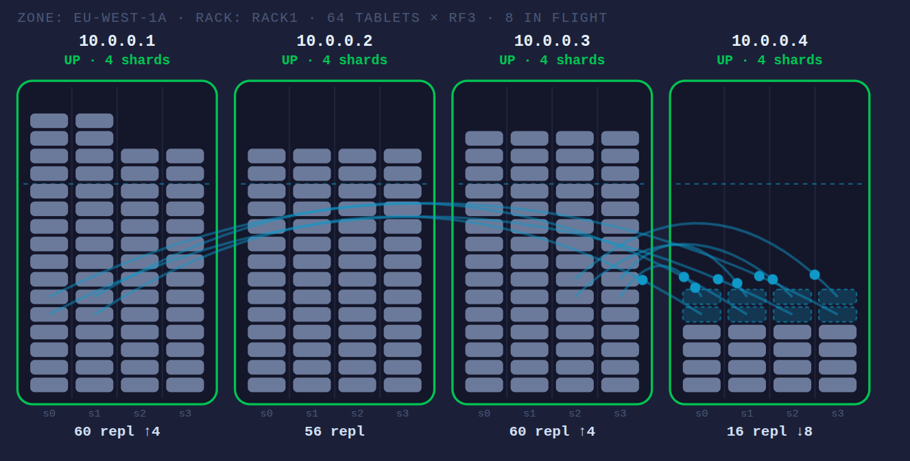

# ScyllaDB Tablet Simulator

An interactive, single-file simulator of ScyllaDB **tablets** — the unit of data distribution
that replaced vnodes. Add, kill and remove nodes in a single zone and watch the load balancer
move tablet replicas around until the cluster is level again.

**v2** replaces v1's placeholder balancer with a port of ScyllaDB's real planner. Every round
is a batch produced by the same rules the real `load_balancer` uses, and the line under the
stage names the rule that ended it — `[LB-10.3] would invert load between 10.0.0.2 and
10.0.0.5`. The rules are written up in [`tablet_balancing_rules.md`](tablet_balancing_rules.md),
extracted from `service/tablet_allocator.cc`; the code cites rule IDs inline.

**[▶ Run it here](https://tzach.github.io/scylladb-tablets-demo/)**

**Disclaimer:** An independent, educational simulator — not an official ScyllaDB product and not
100% behaviourally accurate to real ScyllaDB internals. Not affiliated with or endorsed by
ScyllaDB, Inc.



*A fourth node joining. Every existing node streams to it at once — two tablets per shard, the
real per-shard concurrency limit — and it is already serving the 16 tablet replicas it has
taken ownership of while the rest are still in flight.*

## Running it

Hosted on GitHub Pages at **<https://tzach.github.io/scylladb-tablets-demo/>**, or run it
locally — it is a static, dependency-free page, with no build step and no server:

```bash
git clone https://github.com/tzach/scylladb-tablets-demo.git
cd scylladb-tablets-demo
open index.html   # or double-click it / drag it into a browser
```

`scylladb-ds.css` is the ScyllaDB design system bundle (copied from
[scylladb-ha-demo](https://github.com/tzach/scylladb-ha-demo)); it follows your OS light/dark
setting. The bundle expects its `fonts/` and `assets/` directories beside it — without them the
page falls back to system fonts, which is why the type here is not Roboto Flex.

## What you are looking at

Each tall box is a node in the one zone/rack. Inside it, one column per **shard** — a tablet
replica belongs to a specific shard, not just to a node. Each pill is one tablet replica,
stacked bottom-up in token order; the dashed line is the ideal load for that shard. The caption
above the stage carries the tablet count, RF and the number of transitions in flight, and each
node's footer shows its replica count with `↓`/`↑` for streams in and out.

| | |
|---|---|
| grey pill | a tablet replica this shard owns |
| dashed pill | pending replica, data streaming in |
| amber pill | old replica, waiting for `cleanup` |
| curved arc | a tablet transition in flight, with the current stage labelled |

Arc colours match the real `tablet_transition_kind`: `migration` (blue) between nodes,
`intranode_migration` (purple) between shards of one node, `rebuild` (magenta) when a replica
is re-created to restore RF.

Hover a pill to see the tablet's token range and every node holding a replica of it; the arcs
for that tablet light up and the rest dim.

## Things to try

- **Add a node.** Every existing node starts streaming to it at once, and it begins serving as
  soon as it owns its first tablet — there are no token ranges to recompute and no `nodetool
  cleanup` afterwards.
- **Decommission a node.** Drain mode (§13) reverses the fan: the leaving node becomes the only
  source and every healthy node a destination, and the convergence checks switch off so the node
  empties completely. RF is preserved throughout. The button picks the node holding the fewest
  replicas and is disabled when the cluster could not keep RF distinct replicas without it.
- **Kill a node.** A dead node cannot stream, so its replicas are re-created from surviving ones
  as `rebuild` transitions (LB-7.16) — watch the arcs start from a *different* node than the one
  that died. The button picks the most-loaded node, since its replicas are the ones the rest of
  the cluster has to reconstruct.
- **Watch the rule readout.** Add a fifth node to a 4-node cluster and the round ends on
  `LB-7.20`: 64 tablets × RF3 does not divide evenly over 5 nodes, so the planner stops one
  tablet short of exact equality rather than oscillating forever.
- **Change *Shards / node*.** The balancer levels tablets across shards, not just across nodes,
  so new shards fill via `intranode_migration`.
- **Raise the replication factor.** Every tablet is now short of a replica, so the balancer
  issues `rebuild` transitions streamed from a surviving replica. Lowering it drops the surplus
  replicas outright — no streaming needed for that direction.
- **Pause, then Step.** One balancer pass at a time, so you can read the stage names on the arcs
  as a transition walks through them.

## What is modelled on real defaults

| | value | source |
|---|---|---|
| target tablet size | 5 GiB → split above 10 GiB, merge below 2.5 GiB | `target_tablet_size_in_bytes` |
| outbound streams per shard | 2 | `tablet_streaming_read_concurrency_per_shard` |
| inbound streams per shard | 2 | `tablet_streaming_write_concurrency_per_shard` |
| transition stages | `allow_write_both_read_old` → `write_both_read_old` → `streaming` → `write_both_read_new` → `use_new` → `cleanup` | `locator/tablets.hh` |
| transition kinds | `migration`, `intranode_migration`, `rebuild` | `locator/tablets.hh` |
| batch size per round | the target node's shard count | LB-7.3 |
| load metric | `used / capacity`, per node and per shard | LB-2.4 |
| in-flight migrations | counted as already complete | LB-1.2 |
| anti-oscillation | a move must not invert load post-move | LB-10.3 |
| one replica per node | never two replicas of a tablet on one node | LB-9.1 |

The per-shard streaming limits are what make a bootstrap parallel and bounded at the same time:
every source shard can feed two streams, so a big cluster fills a new node quickly without any
single shard being saturated.

Reads and writes never stop during a transition: the tablet is served by the old replica right
up to `use_new`, which is why the arc's stage label is worth watching.

### Deliberate simplifications

- One zone / one rack, so replica placement is just "one replica per node" — no rack-aware or
  multi-DC placement.
- The balancer runs in **capacity-based mode**: every tablet is assumed to be exactly
  `target_tablet_size`. That is a real ScyllaDB configuration
  (`force_capacity_based_balancing`), not an invention — but it means the size-based path, where
  per-tablet sizes come from load stats and balance is called at a 1% spread threshold
  (LB-10.1), is not exercised here. With one uniform table, the table-aware `badness` term (§6)
  also has little to distinguish between candidates.
- One table, and every tablet the same size, so a tablet's size is never read from load stats.
- Resize (§14), merge colocation (§15), repair and RF-change plans are out of scope; RF
  restoration after a kill or an RF raise is kept from v1 and does not follow §14.
- The table is a fixed 320 GB (`TABLE_GB`), which is what puts the tablet count at 64 by the
  5 GB target. Split and merge still happen — the tablet count has a floor of one tablet per
  shard, so growing the cluster wide enough splits the tablet map. Split and merge are instant
  metadata edits, deferred while any transition is in flight, and a merge keeps the left
  sibling's replica set rather than co-locating siblings first, leaving the balancer to clean
  up the resulting imbalance.
- No node failure: nodes are added and decommissioned gracefully, never killed. `rebuild` is
  reachable by raising RF rather than by losing a node.
- Tablet count is capped at 128 and nodes at 10, for rendering, not for realism.
- Changing shard count folds replicas onto the surviving shards; real ScyllaDB does not reshard
  tablet data on restart.

## The balancer, rule by rule

The planner is stateless and incremental: one call returns a small batch, the driver executes
it, and it is called again — balance is reached when a call returns nothing (LB-0.1). What v2
implements, with section numbers from
[`tablet_balancing_rules.md`](tablet_balancing_rules.md):

| | |
|---|---|
| §2 | load is `used/capacity` at node *and* shard level, in-flight moves counted as done |
| §3 | scope selection: which nodes participate, which are drain sources |
| §4 | candidate sets per `(node, shard)`, excluding anything already in transition |
| §6 | `badness` — the table-aware term, node imbalance ranked ahead of shard imbalance |
| §7 | the inter-node loop: one target, sources most-loaded first, batch capped at the target's shard count |
| §8 | escalation to a wider destination search when the first candidate is bad |
| §9 | replication constraints; here LB-9.1, since one zone makes the rack rules vacuous |
| §10 | convergence: the balanced test, and the post-move inversion check that guarantees termination |
| §11 | per-shard streaming admission, including the `>0` guard that never starves a shard |
| §12 | the intra-node loop, levelling shards within a node |
| §13 | drain mode, with viable-target retry and an explicit drain failure |

Two rules are worth watching because they are what stops the balancer churning:

- **LB-10.3** requires that a move leave the source *still* more loaded than the destination
  becomes. Comparing only current loads would let a move overshoot, and the next round would
  undo it.
- **LB-9.1** caps any node at one replica per tablet, so no node can ever hold more than
  `1/RF` of the data. Add one very large node to a small cluster and it saturates there,
  looking half-empty — the readout says so rather than the planner spinning.

## References

- [Data Distribution with Tablets](https://docs.scylladb.com/manual/stable/architecture/tablets.html)
- [How We Implemented ScyllaDB's "Tablets" Data Distribution](https://www.scylladb.com/2024/06/17/how-tablets/)
