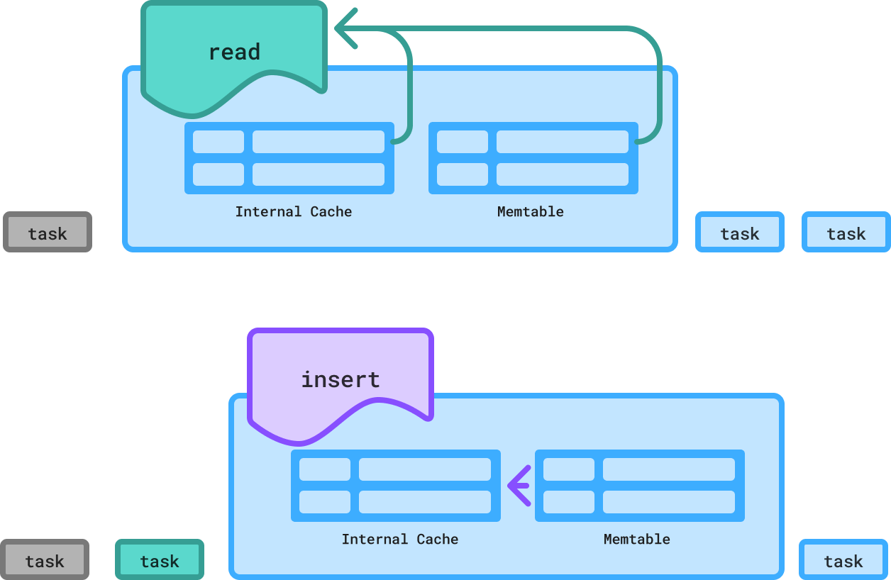
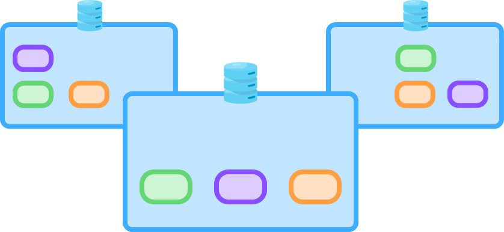
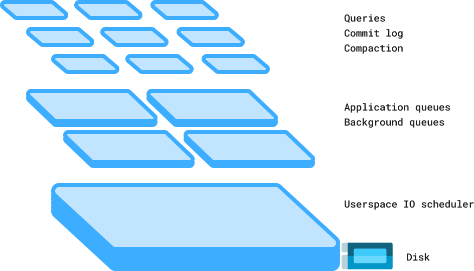

:hide-secondary-sidebar:

.. meta::
   :description: ScyllaDB is known for engineering optimizations that enable predictable performance at scale. If you are interested in database internals, we encourage you to browse our engineering blog, watch our tech talks from past and present conferences, and review our architecture details.
   :keywords: ScyllaDB, database, internals, engineering, optimizations, performance, scale, blog, tech talks, conferences, architecture

Technical Differentiators
-------------------------

ScyllaDB is known for engineering optimizations that enable predictable performance at scale. If you are interested in database internals, we encourage you to browse our `engineering blog <https://www.scylladb.com/category/engineering/>`_, watch our tech talks from `past <https://www.scylladb.com/resources/tech-talks/?presentation-type=878>`_ and `present conferences <https://www.scylladb.com/monster-scale-summit/on-demand/>`_, and review our `architecture details <https://www.scylladb.com/product/technology/>`_.

.. raw:: html

    

.. card-box::
    :link: #
    :image: ../../_static/icons/architecture.svg" style="width:24px
    :title: Architecture for Extreme Scale

.. card-box::
    :link: #
    :image: ../../_static/icons/video_library.svg" style="width:24px
    :title: 10 Years and Beyond with ScyllaDB

.. card-box::
    :link: #
    :image: ../../_static/icons/architecture.svg" style="width:24px
    :title: A Deep Dive into ScyllaDB's Architecture

.. raw:: html

    
&nbsp;

Shard per Core
==============

.. raw:: html

    

        

With ScyllaDB’s unique shard-per-core architecture, each CPU core gets its own dedicated slice of resources (memory, network, and storage). Since there is minimal interaction between the cores, each core runs independently and efficiently, without context switching, locking, or waiting.

By eliminating resource contention, this design enables consistent low latencies and true linear scaling (e.g., doubling the number of cores doubles the performance). Since ScyllaDB can extract more power from modern hardware, we can provide exceptional price performance.

`Learn more about shard-per-core architecture <#>`_

.. raw:: html

        

    

      
      <dotlottie-wc src="https://developers.scylladb.com/stable/_static/img/shard-per-core-no-bg.lottie" speed="1" style="width: 300px; height: 300px; margin-top: -50px" mode="forward" loop autoplay></dotlottie-wc>

.. raw:: html

      

    

Internal Caching
================

.. raw:: html

    

        

ScyllaDB completely bypasses the Linux cache during reads and uses its own highly efficient row-based integrated internal cache instead. This unified cache can dynamically tune itself to any workload.

This provides ScyllaDB the control needed to deliver ultra-low latency without an external cache. It enables each ScyllaDB node to serve more data, which in turn lets users run smaller clusters of more powerful nodes with larger disks.

`Learn more about our internal cache <https://www.scylladb.com/2024/01/08/inside-scylladbs-internal-cache/>`_

.. raw:: html

        

    

.. raw:: html

      

    

Tablets Elasticity
==================

.. raw:: html

    

        

Each ScyllaDB table is split into smaller fragments (“tablets”) to evenly distribute data and load across the system. Tablets are then replicated to multiple ScyllaDB nodes for high availability and fault tolerance. This approach separates token ownership from servers – ultimately allowing ScyllaDB to scale faster and in parallel.

With tablets, data is dynamically redistributed as the workload and topology evolve. New nodes can be spun up in parallel and start adapting to the load in near real-time. This means teams can quickly scale out in response to traffic spikes – satisfying latency SLAs without needing to overprovision “just in case.”

`Learn more about elasticity <https://www.scylladb.com/2024/06/13/why-tablets/>`_

.. raw:: html

        

    

.. raw:: html

      

    

Schedulers
==========

.. raw:: html

    

        

ScyllaDB uses its own built-in CPU and IO schedulers. It can automatically prioritize its own activities due to real-time, real-world conditions.

Even under the most intense workloads, ScyllaDB runs smoothly without requiring frequent administrator supervision and intervention.

`Learn more about schedulers <https://www.scylladb.com/2022/08/03/implementing-a-new-io-scheduler-algorithm-for-mixed-read-write-workloads/>`_

.. raw:: html

        

    

.. raw:: html

      

    

Workload Prioritization
=======================

.. raw:: html

    

        

Workload Prioritization controls how different workloads compete for system resources. It's used to prioritize urgent application requests that require immediate response times versus others that can tolerate slight delays (e.g., large scans).

Common use cases include balancing real-time vs batch processing, splitting writes from reads, and workload/infrastructure consolidation.

`Learn more about workload prioritization <https://www.scylladb.com/tech-talk/workload-prioritization-how-to-balance-multiple-workloads-in-a-cluster/>`_

.. raw:: html

        

    

.. raw:: html

      

    

