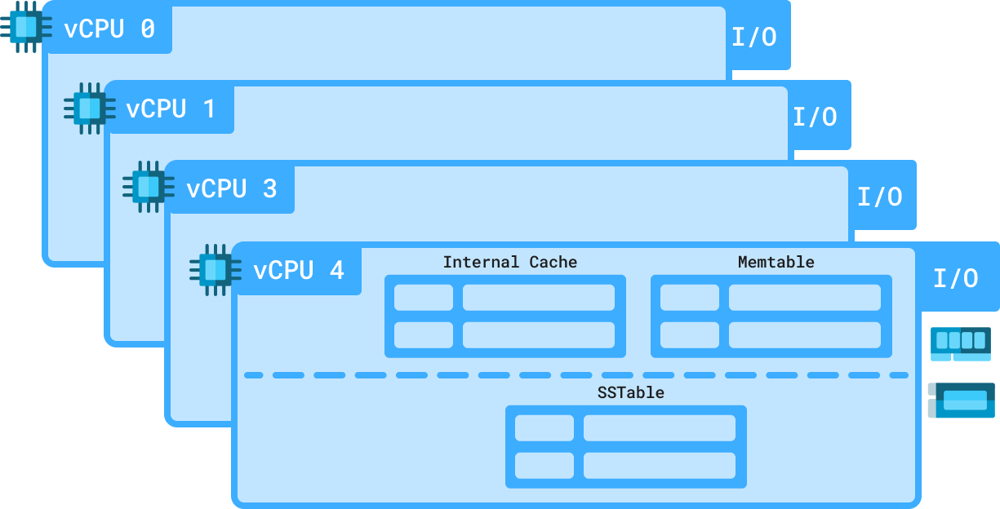

:hide-secondary-sidebar:

Technical Differentiators
=========================

ScyllaDB is known for engineering optimizations that enable predictable performance at scale. If you are interested in database internals, we encourage you to browse our `engineering blog <https://www.scylladb.com/category/engineering/>`_, watch our tech talks from `past <https://www.scylladb.com/resources/tech-talks/?presentation-type=878>`_ and `present conferences <https://www.scylladb.com/monster-scale-summit/on-demand/>`_, and review our `architecture details <https://www.scylladb.com/product/technology/>`_.

.. raw:: html

    

.. card-box::
    :link: #
    :image: ../../_static/icons/architecture.svg" style="width:24px
    :title: Architecture for Extreme Scale

.. card-box::
    :link: #
    :image: ../../_static/icons/video_library.svg" style="width:24px
    :title: 10 Years and Beyond with ScyllaDB

.. card-box::
    :link: #
    :image: ../../_static/icons/architecture.svg" style="width:24px
    :title: A Deep Dive into ScyllaDB's Architecture

.. raw:: html

    
&nbsp;

==============
Shard per Core
==============

.. raw:: html

    

        

ScyllaDB’s Shard per Core architecture ensures that each shard is bound to a dedicated CPU core, along with its own share of data. This means every core has dedicated resources—its own cache, memtables, and SSTables—residing in its own RAM and persistent storage.

Each core also gets dedicated networking I/O channels, eliminating bottlenecks and ensuring efficient data transfer. By operating independently, cores minimize contention and maximize parallelism, allowing ScyllaDB to fully utilize modern hardware for predictable, high-performance scaling.

`Learn more <#>`_

.. raw:: html

        

    

.. raw:: html

      

    

================
Internal Caching
================

.. raw:: html

    

        

ScyllaDB completely bypasses the Linux cache during reads, using its own highly efficient row-based cache instead. This approach provides us the control needed to achieve predictable low latencies. It also allows us to offer users full visibility into details like cache hits and misses, evictions, and cache size.

This approach eliminates locking and complex lock-free algorithms, allowing short tasks to execute serially with cooperative preemption. The result? Simpler, more efficient data structures and a system that delivers low-latency, high-performance queries without the overhead of traditional multi-threaded contention.

`Learn more <https://www.scylladb.com/2024/01/08/inside-scylladbs-internal-cache/>`_

.. raw:: html

        

    

.. figure:: images/cache.png
   :width: 300px
   :alt: Internal Caching

.. raw:: html

      

    

==================
Tablets Elasticity
==================

.. raw:: html

    

        

ScyllaDB’s Tablets build on the shard-per-core model, maintaining the same mapping as vNodes but with greater flexibility. Unlike vNodes, Tablets can be dynamically reallocated within a node to optimize CPU and storage usage.

Each table in a keyspace is divided into equal-sized Tablets, ensuring balanced distribution. Smaller tables get fewer Tablets, while larger tables scale efficiently. This dynamic approach improves load balancing, resource efficiency, and overall performance, making ScyllaDB even more adaptive to real-world workloads.

`Learn more <https://www.scylladb.com/2024/06/13/why-tablets/>`_

.. raw:: html

        

    

.. figure:: images/tablets.png
   :width: 300px
   :alt: Tablets

.. raw:: html

      

    

==========
Schedulers
==========

.. raw:: html

    

        

ScyllaDB uses its own built-in CPU and IO schedulers. It can automatically prioritize its own activities due to real-time, real-world conditions.

Even under the most intense workloads ScyllaDB runs smoothly without requiring frequent administrator supervision and intervention.

`Learn more <https://www.scylladb.com/2022/08/03/implementing-a-new-io-scheduler-algorithm-for-mixed-read-write-workloads/>`_

.. raw:: html

        

    

.. figure:: images/schedulers.png
   :width: 300px
   :alt: Schedukers

.. raw:: html

      

    

=======================
Workload Prioritization
=======================

.. raw:: html

    

        

Workload Prioritization controls how different workloads compete for system resources. It's used to prioritize urgent application requests that require immediate response times versus others that can tolerate slighter delays (e.g., large scans).

Common use cases include balancing real-time vs batch processing, splitting writes from reads, and workload/infrastructure consolidation.

`Learn more <https://www.scylladb.com/tech-talk/workload-prioritization-how-to-balance-multiple-workloads-in-a-cluster/>`_

.. raw:: html

        

    

.. figure:: images/cache.png
   :width: 300px
   :alt: Workload Prioritization

.. raw:: html

      

    
