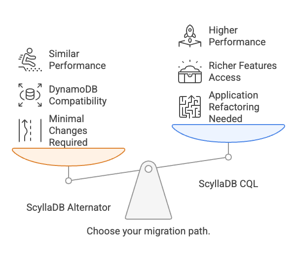
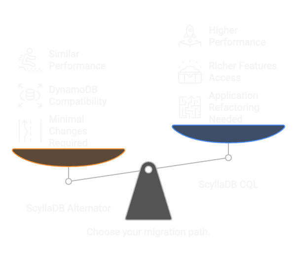

Migration Paths
---------------

The process for moving from DynamoDB to ScyllaDB depends on whether you decide to use Alternator or CQL. In general:

#. **Migrating to ScyllaDB Alternator**: Minimal changes required. DynamoDB-compatible applications run natively without modifications. Tables and data types are fully compatible. This allows running DynamoDB-compatible workloads outside AWS, on any cloud or on-premises.

#. **Migrating to ScyllaDB CQL**: Requires application refactoring. You need to rewrite the application to use CQL drivers and modify table schemas to fit CQL’s data model. The tradeoff is access to ScyllaDB’s richer feature set and higher performance.

DynamoDB to Alternator
======================

Migrating from DynamoDB to Alternator (ScyllaDB's DynamoDB-compatible API):

#. No application rewrites needed
#. Simply redirect the application endpoint to the Alternator cluster
#. Existing table designs and application logic remain functional
#. Enables running DynamoDB-compatible workloads in any environment

Note: Application adjustments may be necessary to work with Alternator's load balancing libraries.

DynamoDB to CQL
===============

Migrating from DynamoDB to CQL:

#. Requires redesigning and changing application tables
#. Offers benefits of a feature-rich, cluster-aware driver
#. Enables higher performance computing
#. Provides more efficient client-server communication

The CQL driver is specifically engineered for high performance, optimizing all aspects of communication between client and server within the ScyllaDB environment.
