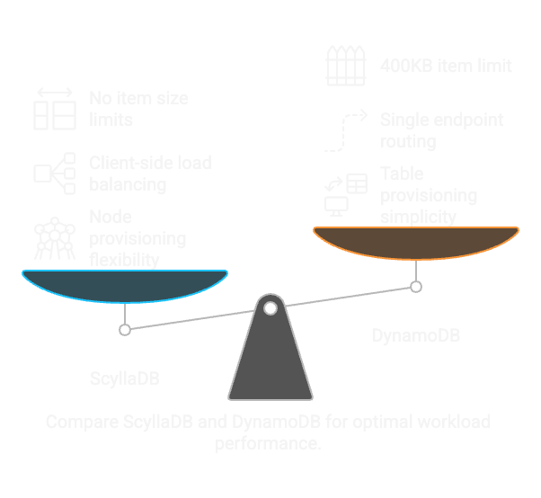

Understanding Differences
=========================

.. image:: understanding-differences-light.png
    :alt: Understanding Differences
    :width: 90%
    :class: light-mode

ScyllaDB offers a lower-latency, higher-performance alternative to DynamoDB, especially for write-heavy workloads. Its C++ architecture and binary protocol enable better resource utilization and scalability. ScyllaDB’s Alternator API provides seamless DynamoDB compatibility, while its CQL mode offers a robust SQL-like querying model with advanced features.

Four key differences are:

#. **Provisioning**: In ScyllaDB you provision nodes, not tables. In other words, a single ScyllaDB deployment is able to host several tables and serve traffic for multiple workloads combined.
#. **Load Balancing**: Application clients do not route traffic through a single endpoint as in AWS DynamoDB (``dynamodb.<region_name>.amazonaws.com``). Instead, clients may use one of our load balancing libraries, or implement a server-side load balancer.
#. **Limits**: ScyllaDB does not impose a 400KB limit per item, nor any partition access limits.
#. **Metrics and Integration**: Since ScyllaDB is not a “native AWS service,” it naturally does not integrate in the same way as other AWS services (such as CloudWatch and others) does with DynamoDB. For metrics specifically, ScyllaDB provides the ScyllaDB Monitoring Stack with specific dashboards for DynamoDB deployments.

========================
Origins and Architecture
========================

Here are the key differences in the origins and architecture of DynamoDB and ScyllaDB:

#. **DynamoDB**: Originates from Amazon's internal Dynamo system, designed in the early 2000s to handle massive e-commerce traffic during peak events like Prime Day. Dynamo emphasized availability and partition tolerance over strong consistency, introducing concepts like consistent hashing, vector clocks, and hinted handoffs.
#. **ScyllaDB**: Inspired by Apache Cassandra, which implemented many Dynamo concepts. ScyllaDB re-engineered Cassandra in C++ to improve performance, reduce latency, and enhance resource utilization.

================
API and Protocol
================

Here are the key differences in the API and protocol used by DynamoDB and ScyllaDB:

#. **DynamoDB**: Uses an HTTP-based protocol with JSON for data transport. This makes it easy to integrate with web-based applications but introduces higher overhead due to the verbose format.
#. **ScyllaDB Alternator (DynamoDB-compatible API)**: Uses the same JSON and HTTP transport as DynamoDB. However, it runs natively on ScyllaDB’s core engine, avoiding the need for a translation layer and also avoiding any negative performance impacts.
#. **ScyllaDB CQL**: Uses a binary protocol for communication. This enables encryption and compression, reducing transport overhead and improving performance.

=====================
Data Model and Schema
=====================

Here are the key differences in the data model and schema used by DynamoDB and ScyllaDB:

#. **DynamoDB**: Uses a flexible schema with primary and sharding keys. Supports local and global secondary indexes, and offers Change Data Capture (CDC) through DynamoDB Streams.
#. **ScyllaDB CQL**: Enforces a schema with partition and clustering keys. Supports advanced features like user-defined types (UDTs), functions, materialized views, and Change Data Capture (CDC).

==============
Query Language
==============

Here are the key differences in the query language used by DynamoDB and ScyllaDB:

#. **DynamoDB**: Uses a key-value and document-based query model. Does not support prepared statements, which increases query overhead for repetitive operations.
#. **CQL (Used by Cassandra as well as ScyllaDB)**: Provides a SQL-like query language. Supports prepared statements, reducing overhead by reusing query plans and transferring only parameters. This is beneficial for high-performance applications.

===========================
Consistency and Write Model
===========================

Here are the key differences in consistency and write models used by DynamoDB and ScyllaDB:

#. **DynamoDB**: Uses a read-modify-write model, making it susceptible to conflicts under concurrent writes.
#. **ScyllaDB**: Uses conflict-free replicated data types (CRDTs) for eventual consistency. This reduces write overhead and boosts efficiency, especially for write-heavy workloads.

===========================
Performance and Scalability
===========================

Here are the key differences in performance and scalability between DynamoDB and ScyllaDB:

#. **DynamoDB**: Requires pre-configuring read and write capacity units (RCUs and WCUs), leading to potential over- or under-provisioning.
#. **ScyllaDB**: Automatically balances workloads across nodes as the cluster scales. The CQL driver reacts to topology changes, ensuring even load distribution without manual intervention.
