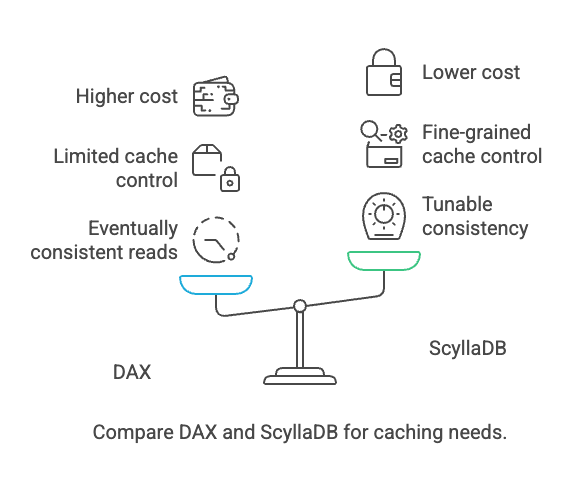
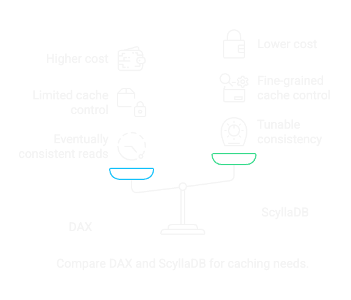

DAX Caching
-----------

DynamoDB Accelerator (DAX) is a managed, in-memory caching layer designed to improve the read performance of DynamoDB. It offloads frequently accessed data for read heavy applications.

When to use DAX
===============

Use DAX when:

#. You have read-heavy workloads with high latency sensitivity.
    DAX shines when you’re hitting the same keys repeatedly and need sub-millisecond reads (vs. DynamoDB’s typical millisecond range).

#. Your data access patterns are predictable and cache-friendly.
    For example, if you’re querying product catalogs, session data, or user profiles that don’t change often, DAX can cut read latencies significantly.

#. You want to reduce pressure on DynamoDB read capacity units (RCUs).
    DAX intercepts requests before they hit the base table, reducing direct reads (and associated costs).

#. You can tolerate eventually consistent reads.
    DAX caches data after a read or write through it. If your app can handle some staleness, it’ll benefit from DAX’s performance gains.

#. You want a managed, drop-in cache.
    AWS abstracts away the operational work (e.g., patching, failover), and DAX integrates directly with existing DynamoDB SDKs (no code rewrite required).

When to avoid DAX
=================

Despite the speed boost, DAX is not universally beneficial. Avoid it when:

#. You need strongly consistent reads.
    DAX does not support strong consistency. If your application relies on always seeing the latest write, DAX will introduce correctness issues.

#. You have highly dynamic or write-heavy data.
    DAX’s cache invalidation model is simplistic. If the data changes frequently, cache hits drop, and staleness becomes a risk.

#. Your workload is bursty or unpredictable.
    Cold caches or unbalanced node usage can lead to spikes in latency as DAX warms up or rebalances.

#. You need fine-grained cache control.
    DAX doesn’t expose TTL tuning per item or per partition. You also don’t get eviction metrics or hooks like you’d expect from Redis/Memcached.

#. You already use an external cache effectively.
    If your stack includes Redis or Memcached and is tailored to your access patterns, DAX might be redundant.

#. You need multi-region caching.
    DAX is tied to a single region. If you use DynamoDB Global Tables and want cross-region caching, DAX won’t help — you’d need a separate caching layer.

#. Your reads aren’t the bottleneck.
    If your app is write-heavy, has complex query logic, or faces latency elsewhere (e.g., app tier), DAX won’t move the needle.

Cost Considerations
===================
.. raw:: html

    
DAX is fast - but not cheap.

#. You pay per node-hour.
    Unlike DynamoDB’s usage based billing, DAX is provisioned like EC2. Each node has a fixed cost based on instance type.

#. No serverless model.
    DAX requires pre-allocated clusters with fixed sizes. You manage (and pay for) the full capacity 24/7, whether you use it or not. This is a big difference from DynamoDB’s pricing.

#. Scaling is manual.
    You must add/remove nodes yourself, and resizing takes time. This can lead to overprovisioning for "just in case" scenarios.

#. No cost offset from DynamoDB RCU savings.
    While DAX reduces RCU usage, it doesn’t reduce your table minimums or burst capacity limits. You’re paying both for the base table and the cache.

#. High availability = more nodes.
    For HA in production, you’ll need a minimum of 3 nodes (multi-AZ), which can push monthly costs well into the thousands of dollars.

How DAX Compares to ScyllaDB
============================

.. raw:: html

    
If you want control, visibility, tunable consistency, and extensibility, ScyllaDB’s internal caching + optional external caches are far more flexible. And if you’re building something that needs correctness and predictability, DAX isn’t even in the running.

At first glance, DAX and ScyllaDB’s caching seem similar: both aim to improve read performance by reducing trips to disk. But they’re fundamentally different in architecture, flexibility, and performance guarantees.

#. Built-In vs. Bolt-On.
    ScyllaDB has a built-in, shard-aware row cache on every node. It automatically keeps hot rows in memory, local to the shard that owns them. This means no network hop, no extra infrastructure, and no configuration overhead. It just works, and it's fast.

    DAX, on the other hand, is a separate caching cluster that sits between your application and DynamoDB. It acts as a read-through cache, meaning reads are intercepted by DAX and only forwarded to DynamoDB if the item isn’t in cache. Writes go directly to DynamoDB and may update DAX depending on the access path. It adds an extra moving part, with all the AWS magic — and all the limitations that come with it.

#. Read Consistency and Cache Staleness.
    ScyllaDB gives you tunable consistency even with the cache in play. You can read with ``QUORUM`` or ``LOCAL_ONE`` and still get strong guarantees depending on your need. The built-in cache respects this model and serves hot data where valid.

    DAX doesn’t support strongly consistent reads at all. It’s eventually consistent by design. If you write an item and immediately read it through DAX, you might get stale data. For many apps, that’s fine. But if correctness matters, DAX is a liability.

#. Control and Observability.
    ScyllaDB has deep visibility: cache hit/miss rates, eviction stats, memory usage — all via `ScyllaDB Monitoring Stack <https://monitoring.docs.scylladb.com/stable/>`_. You can size the cache, understand performance at the shard level, and tune it like a high-performance engine.

    With DAX you get some CloudWatch metrics and health indicators, but no insight into which keys are hot, what’s being evicted, or how cache memory is being used. You can’t control TTLs per key or evict specific entries. It’s a managed service, for better or worse.

#. Performance.
    ScyllaDB’s cache is constantly adapting to access patterns. Since it’s local to the node and shard, latency stays consistent, even on cache misses. There’s no separate tier to worry about, and no manual cluster resizing. Just fast reads.

    DAX can be extremely fast when it’s hot but that’s assuming:

    * The item is in cache.
    * The DAX cluster is warm.
    * There’s no failover or rebalancing event.
    * Your app tolerates stale reads.

    When DAX is cold or the data changes often, hit rates drop and latency jumps as it hits the base table. You’re also subject to DAX cluster sizing. Under-provision and it bottlenecks. Over-provision and you’re wasting money.

#. Cost, Lock-in, and Flexibility.
    ScyllaDB’s row cache is included with no separate charge. You’re not locked in to AWS.

    DAX adds cost per node-hour and doesn’t scale down automatically. You pay for provisioned nodes 24/7. With high availability you’re running at least three nodes across AZs. Combine that with DynamoDB’s table costs and transfer fees, and your caching bill quickly adds up.

    If you want a fast but limited caching layer, tightly integrated with DynamoDB, and you’re OK with the trade-offs, DAX can help.
