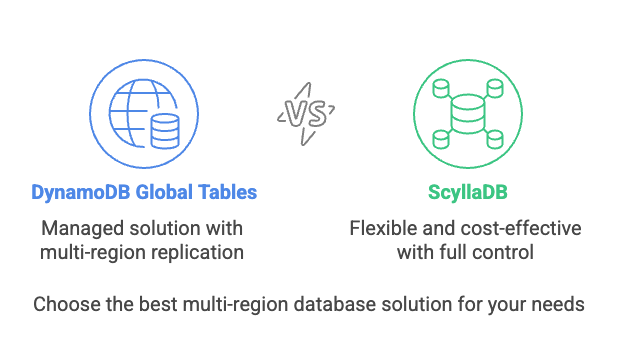
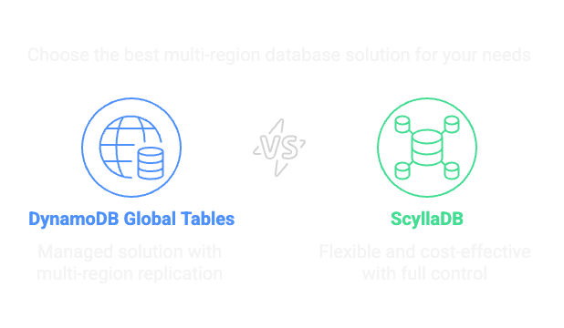

Global Tables
-------------

DynamoDB Global Tables are a managed solution for multi-region, active-active replication. They allow you to create tables that automatically replicate data across multiple AWS regions, providing low-latency access to your data from anywhere in the world.

When to Use Global Tables
=========================

DynamoDB Global Tables are useful when:

#. You have a globally distributed user base.
    If your application must deliver low-latency reads and writes from multiple AWS regions (e.g., users in North America and APAC), Global Tables replicate data across selected regions automatically.

#. You need high availability across regions.
    Global Tables provide multi-region, active-active replication, which can keep your app online even if one AWS region goes down.

#. You want a managed multi-region replication solution.
    With Global Tables, AWS handles all the complexity of syncing data between replicas (at a cost).

#. Your workload can tolerate DynamoDB’s eventual consistency model.
    Global Tables resolve conflicts using last writer wins (LWW) based on timestamps.

#. You’re building cross-region disaster recovery.
    DynamoDB Global Tables can help avoid complex custom replication or failover logic by keeping data mirrored in multiple regions.

When to Avoid Global Tables
===========================

Global Tables come with architectural constraints and hidden complexity. Avoid them when:

#. You need precise conflict resolution.
    LWW is lossy. If two clients write to the same item in different regions within the same second, one will be silently dropped. ScyllaDB gives you full control with tunable consistency and conflict resolution. DynamoDB does not.

#. You require strong consistency guarantees.
    Global Tables offer only eventual consistency across regions. If you need guarantees like quorum reads/writes (as in ScyllaDB’s tunable consistency), you won’t get them from DynamoDB.

#. Your app performs frequent cross-region writes.
    High volume write activity in multiple regions can lead to replication lag and conflict overwrite issues. ScyllaDB’s architecture is specifically designed to handle this with low latency and high throughput.

#. You need tight control over latency and throughput.
    Global Tables replication introduces unpredictable latencies. You can’t control internals like replication buffer size or timing. ScyllaDB’s architecture allows you to optimize for your specific workload and latency requirements.

#. You’re sensitive to vendor lock-in.
    Global Tables are tightly coupled with AWS infrastructure. There's no way to replicate them outside of AWS regions or integrate with other systems easily. ScyllaDB runs anywhere, from any public cloud to on-premise.

#. You want cost transparency.
    Costs are opaque and can spike unexpectedly. You pay for every write in every region, plus cross-region data transfer fees. This can lead to unpredictable bills, especially if you’re not monitoring usage closely. Use :doc:`DynamoDB Cost Calculator <calculator>` to model expected workloads and costs.

Cost Considerations
===================

.. raw:: html

    
Global Tables are expensive, especially for write-heavy, multi-region apps!

#. Write costs are multiplied.
    Every replicated write counts as a write in every region. So a single write to a 3-region Global Table is charged as 3 writes. One for the primary region and and two more rWCU (or rWRU for On Demand) for the replicated regions.

#. Replication traffic incurs cross-region data transfer charges.
    AWS charges for every GB sent between regions. This is not included in your DynamoDB capacity charges and can add up quickly.

#. Provisioned capacity needs to be sized per region.
    You can’t provision one write unit and have it replicated; each region must handle its own load.

#. Writing to Global Secondary Indexes count.
    Writing to a global secondary index (GSI) is considered a local write operation and uses regular write units.

#. rWCUs cannot be reserved.
    There is no reserved capacity available for rWCUs at this time. Purchasing reserved capacity for WCUs might still be beneficial for tables where GSIs consume write units.

#. Bootstrapping new regions come with a cost.
    When you add a new Region to a global table, DynamoDB bootstraps the new Region automatically and charges you as if it were a table restore, based on the GB size of the table. It also charges cross region data transfer fees.

#. Operational overhead is hidden but real.
    Monitoring, diagnosing replication lag, dealing with silent conflicts. These things cost you development and operations time, even if they’re "managed" or "serverless."

#. Inflexibility in capacity scaling.
    Even with On Demand, costs can balloon unpredictably when replication spikes.

.. tip::

    If you’re building a global application with modest write rates and minimal write conflicts, Global Tables might work, at a price. But if you want control, visibility, and efficiency, ScyllaDB -- with custom replication or external CDC-based tooling -- gives you more power and fewer surprises.

How Global Tables Compare to ScyllaDB
=====================================

.. raw:: html

    
ScyllaDB gives you the power to build global applications without the complexity and cost of Global Tables.

ScyllaDB offers a more flexible and cost-effective solution for multi region applications. Here’s how it stacks up against DynamoDB Global Tables:

#. Cost.
    ScyllaDB’s pricing is more predictable and transparent. You pay for what you use, without hidden replication costs.

#. Control.
    ScyllaDB gives you full control over replication, consistency, and conflict resolution. You can choose how to handle conflicts and set your own tunable consistency levels in your system topology.

#. Shard awareness.
    ScyllaDB's client drivers are shard-aware and region-aware, meaning they can route requests to the appropriate shard and region. This reduces latency, avoids cross region network costs, and improves performance.

#. Flexibility.
    ScyllaDB allows you to replicate data across any number of regions, not just AWS. You can also integrate with other systems easily.

#. Performance.
    ScyllaDB’s architecture is designed for low-latency, high-throughput workloads. You can optimize performance based on your specific use case.

#. Operational simplicity.
    ScyllaDB’s architecture is designed for simplicity and ease of use. You can monitor and manage your clusters easily, without the complexity of Global Tables.

#. No vendor lock-in.
    ScyllaDB runs anywhere, from any public cloud to on-premise. You’re not tied to AWS infrastructure or pricing models.
