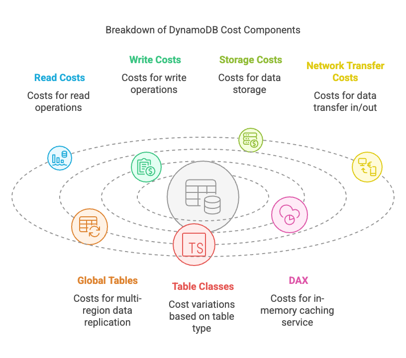
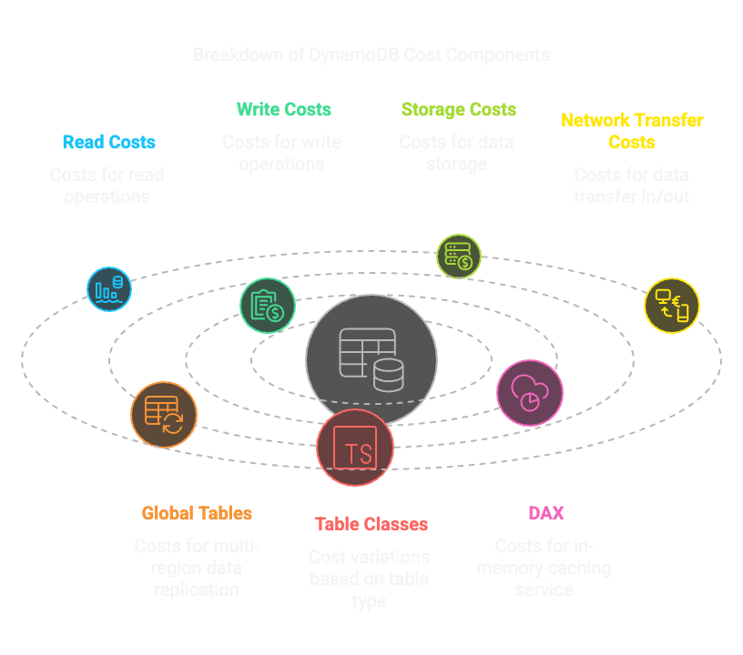

Understanding Cost Units
------------------------

DynamoDB offers two pricing models: `On Demand <https://aws.amazon.com/dynamodb/pricing/on-demand/>`_ and `Provisioned <https://aws.amazon.com/dynamodb/pricing/provisioned/>`_. Each model has its own pricing structure and is designed to meet different needs. The pricing model you choose will depend on your application's requirements and usage patterns.

Linked to these pricing models are different cost units that you need to understand to estimate your costs accurately.

Reads Explained
===============

On Demand pricing consumes Read Request Units and Provisioned pricing consumes Read Capacity Units (RCUs) for reads. Both terms refer to the same thing: a unit of read throughput for reads of up to 4 KB.

One read unit represents one strongly consistent read per second, or two eventually consistent reads per second, for an item up to 4 KB in size. The prices for read requests and capacity units depend on your table class and pricing model.

Consistent reads are more expensive than eventually consistent reads because they require more resources to ensure that the data is up-to-date. If you can tolerate some lag in the data, you can use eventually consistent reads to save on costs.

Writes Explained
================

On Demand pricing consumes Write Request Units and Provisioned pricing consumes Write Capacity Units (WCUs) for writes. Both terms refer to the same thing: a unit of write throughput for writes of up to 1 KB.

One write unit represents one write for an item up to 1 KB in size. The prices for write requests and capacity units depend on your table class and pricing model.

Writes are more expensive than reads because they require more resources to ensure that the data is written to the database. If you can batch your writes, you can save on costs by writing multiple items in a single request.

Replicated Writes Explained
===========================

When using DynamoDB Global Tables, your data is automatically written to multiple AWS regions of your choice. Each write occurs in the local region as well as the replicated regions. This is known as a replicated Write Capacity Unit (rWCU). The cost of rWCUs is the same as the cost of WCUs, but you will be charged for each region that you replicate your data to.

.. warning::

    This can significantly increase your costs, especially if you are replicating large amounts of data as part of Global Tables. Be sure to factor in these costs when estimating your overall DynamoDB costs. You can simulate these costs using our :doc:`DynamoDB Cost Calculator <calculator>`.

Storage Explained
=================

Storage costs are based on the amount of data stored in DynamoDB. You are charged based on the amount of data stored in your tables, indexes, and backups.

DynamoDB automatically scales storage for your tables based on the size of your items and the number of items in your tables. You do not need to provision storage in advance, and you only pay for the storage you use.

.. note::

    DynamoDB storage costs are based on the amount of data stored in your tables, indexes, and backups. You are charged for the total amount of data stored in your tables, including any indexes and backups.

    For example:

    * If you store 1 GB of data in your table, you will be charged for 1 GB of storage.
    * If you store 1 GB of data in your table and 1 GB of data in an index, you will be charged for 2 GB of storage.
    * If you store 1 GB of data in your table and 1 GB of data in a backup, you will be charged for 2 GB of storage.

Item Size Explained
===================

The size of your items in DynamoDB affects the cost of your reads and writes. DynamoDB charges based on the size of the items you read and write, rounded up to the nearest block size (for reads, this is 4 KB; for writes, this is 1 KB). If your items are larger than this block size, you will need to consume additional RCUs and WCUs to read and write the items.

.. warning::

    DynamoDB will **always round up the item size** to the nearest block size when calculating the cost of reads and writes. This can significantly affect your costs, especially if you are working with large or varying sized items.

    For example:

    * If you read an item that is 300B in size, you will need to consume 1 RCU for a strongly consistent read, or 0.5 RCUs for an eventually consistent read.
    * If you read an item that is 5000B in size, you will need to consume 2 RCUs for a strongly consistent read, or 1 RCU for an eventually consistent read. This is because the item size is rounded up to the nearest block size of 4 KB. i.e. 5000/4096 = 1.22, which is rounded up to 2.
    * If you write an item that is 300B in size, you will need to consume 1 WCU.
    * If you write an item that is 5000B in size, you will need to consume 5 WCUs. This is because the item size is rounded up to the nearest block size of 1 KB i.e. 5000/1024 = 4.88, which is rounded up to 5.

Network Transfer Explained
==========================

Network transfer costs are based on the amount of data transferred in and out of DynamoDB. You are charged based on the amount of data transferred between your application and DynamoDB, as well as between DynamoDB and other general AWS services (when they are in different regions).

DynamoDB charges for data transferred out of the service, but there are no charges for data transferred into the service. The cost of data transfer is based on the amount of data transferred in GB. The first 1 GB of data transferred out is free, but you are charged for any additional data transferred out.

.. warning::

    DynamoDB does not charge for data transferred between AWS services in the same region. However, if you transfer data between different regions, you will be charged for the data transfer. These costs can add up quickly, especially if you are transferring large amounts of data or if you are using multiple regions for your application with global tables. A good example of this is if you are using DynamoDB Global Tables, where you will be charged for the data transfer between regions.

    For example:

    * If you transfer 1 GB of data out of DynamoDB to another AWS service in the same region, you will not be charged.
    * If you transfer 1 GB of data out of DynamoDB to another AWS service in a different region, you will be charged for the data transfer.
    * If you transfer 1 GB of data out of DynamoDB as part of Global Tables, you will be charged for the data transfer.

Change Data Capture Units Explained
===================================

Change data capture (CDC) is a technique used to track changes to data in a database. In DynamoDB, CDC is used to capture changes to items in your tables and replicate them to other AWS services. DynamoDB charges for change data capture units based on the number of changes captured and the size of the items being captured. DynamoDB charges one change data capture unit for each write to your table (up to 1 KB). For items larger than 1 KB, additional change data capture units are required.

.. note::

    Such operations are supported in ScyllaDB with the `Change Data Capture <https://docs.scylladb.com/manual/stable/features/cdc/cdc-intro.html>`_ feature, but they are not included in our :doc:`DynamoDB Cost Calculator <calculator>`.

Table Classes Explained
=======================

DynamoDB offers two table classes designed to help you optimize for cost. The DynamoDB Standard table class is the default, and it's recommended for the vast majority of workloads. The DynamoDB Standard-Infrequent Access (DynamoDB Standard-IA) table class is optimized for tables that store data that is accessed infrequently, where storage is the dominant cost. Each table class offers different pricing for data storage as well as read and write requests. You can select the most cost-effective table class based on your table’s storage requirements and data access patterns.

.. note::

    The DynamoDB Standard-IA table class is not supported in ScyllaDB. If you are using the DynamoDB Standard-IA table class, you will need to migrate your data to the DynamoDB Standard table class before migrating to ScyllaDB.

Global Tables Explained 
=======================

Global Tables are a DynamoDB feature that allows you to replicate your data across multiple AWS regions. This is useful for applications that require low latency access to data from multiple regions or for disaster recovery purposes. Global Tables are charged based on the number of write request units consumed in each region, as well as the amount of data transferred between regions.

.. warning::

    Global Tables costs can add up quickly, especially if you are replicating large amounts of data or if you are using multiple regions for your application. Be sure to factor in these costs when estimating your overall DynamoDB costs. Refer to our guide on :doc:`DynamoDB Global Tables <global-tables>` for more information.

DynamoDB Accelerator (DAX) Explained
====================================

DynamoDB Accelerator (DAX) is a fully managed, in-memory caching service for DynamoDB. DAX is designed to improve the performance of read-heavy workloads by caching frequently accessed data in memory. DAX is charged based on the number of DAX nodes you provision and the amount of data stored in the cache.

.. note::

    ScyllaDB implements a similar caching mechanism called `ScyllaDB Cache <https://docs.scylladb.com/architecture/scylla-cache/>`_ that is designed to improve the performance of read-heavy workloads. However, ScyllaDB does not charge for caching, as it is included in the overall cost of running ScyllaDB. Refer to our guide on :doc:`DAX Caching <dax>` for more information.
