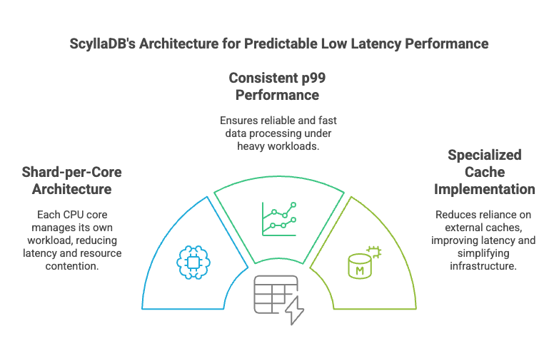

:hide-secondary-sidebar:

.. meta::
   :description: Learn how ScyllaDB achieves sub-millisecond latency through shard-per-core architecture, optimized caching, and minimal resource contention..

Improving Latency
-----------------

.. image:: ../images/improving-latency-dark.png
    :alt: Improving Latency
    :width: 90%
    :class: dark-mode

ScyllaDB is purpose-built to deliver predictable low latency for data-intensive applications, making it an excellent choice for workloads where response time is critical. Its shard-per-core architecture ensures that each CPU core handles its own dedicated workload, eliminating resource contention and reducing latency to single-digit milliseconds. This design allows ScyllaDB to provide consistent p99 performance, ensuring reliable and fast data processing even under heavy workloads.

By tuning the system and optimizing how data is accessed and processed, ScyllaDB excels in scenarios like time-series data retrieval, real-time analytics, and high-frequency updates, where low latency is a fundamental requirement.

ScyllaDB leverages a built in cache, which reduces reliance on external caching systems. This simplifies infrastructure and improves latency by maximizing the use of memory per core.
