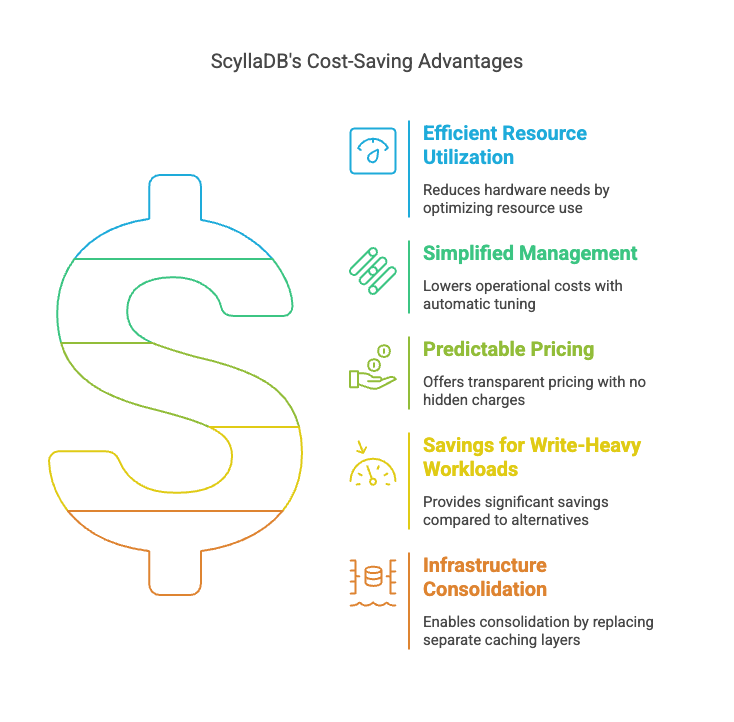

:hide-secondary-sidebar:

Reducing Costs
--------------

.. image:: ../images/reducing-costs-dark.png
    :alt: Reducing Costs
    :width: 90%
    :class: dark-mode

ScyllaDB offers a compelling cost-saving proposition for organizations dealing with data-intensive applications. Its close-to-the-metal architecture and efficient use of hardware resources allow for significant reductions in infrastructure costs.

Its ability to scale to petabytes of data and millions of operations per second without interruption means that organizations can grow their data footprint and keep latencies in check in peak workloads during events. This smooth scaling capability, combined with ScyllaDB's high throughput and low latency, allows companies to handle increasing workloads without surprising increases in infrastructure investment.

ScyllaDB is particularly cost-efficient for teams with write-heavy workloads and moderate to high throughput. The cost benefits become more pronounced as scale increases, making it an attractive option for growing use cases. Additionally, ScyllaDB's built-in cache replaces external caches, reduces application complexity, and enables infrastructure consolidation, all of which contribute to overall cost savings.

Key cost-saving aspects of ScyllaDB include:

#. Reduced hardware requirements due to efficient resource utilization.
#. Lower operational costs through simplified management and automatic tuning.
#. Predictable and transparent pricing with no unexpected charges.
#. Significant savings for write-heavy workloads compared to alternatives like DynamoDB and MongoDB.
#. Potential for infrastructure consolidation by replacing separate caching layers such as Redis, ElastiCache or DAX.
