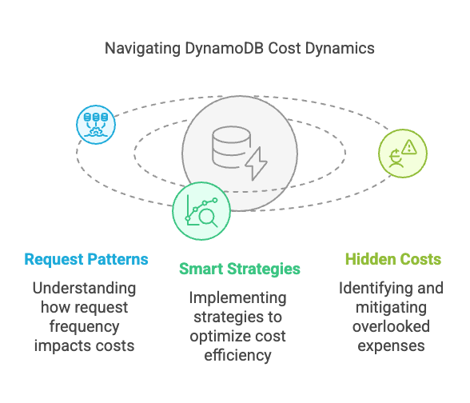
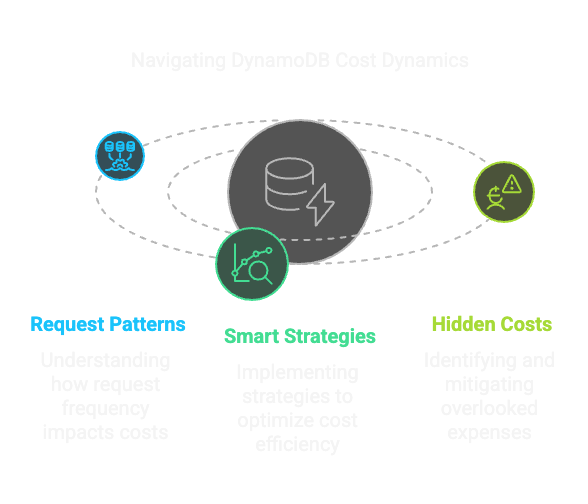

.. meta::
   :description: Learn how DynamoDB request patterns drive unexpected costs. From traffic spikes to TTL deletes, Global Tables, and DAX—understand hidden billing risks and how to manage them.

How Request Patterns Lead to DynamoDB Billing Surprises
-------------------------------------------------------

DynamoDB’s pricing is heavily tied to how your application interacts with it. Small changes in request patterns can lead to big cost spikes, especially if you’re not monitoring usage or optimizing access. This makes operating with DynamoDB a bit like walking a tightrope: one misstep and you could be falling into the danger zone.

Here’s what to watch out for.

Request Spikes = Cost Spikes
============================
DynamoDB charges per read/write unit. In On Demand mode, every request impacts your costs. If your app suddenly increases request volume due to a bug, traffic spike, or misconfigured job, you’ll see it directly reflected on your bill. This is what is commonly referred to as "bill shock."

If you’re using the Provisioned pricing model, overestimating capacity means paying for what you don’t use. Underestimating means throttling, retries, and possibly even more costs depending on how your client handles retries. Auto scaling can help, but it’s not easy to get right. It’s not just about setting a target utilization; you also need to consider the cooldown period, which is the time it takes for DynamoDB to adjust capacity after a scaling event. It can take time to react to spikes. If you’re not careful, you could end up with a lot of throttled requests resulting in retries, a bad user experience, and increased costs.

Smart Cost Management Strategies
================================

We've spoken to many DynamoDB users and experts about workarounds for managing costs. Here are some of the most effective ones:

#. Pick the right mode.
    Use Provisioned if traffic is steady and predictable.
    Use On-Demand if traffic is spiky or hard to forecast. Be careful with this mode, though; it can lead to bill shock if you’re not monitoring usage closely.

#. Instrument and monitor.
    Use CloudWatch and set budgets in AWS Billing to catch anomalies early. Monitor not just overall throughput, but also table/index-specific metrics. You must understand your query access patterns to avoid surprises.

#. Data model matters.
    Poor design leads to excessive reads, writes, and index usage. Minimize the number of operations per request by denormalizing data where appropriate. This is true for any NoSQL database, but especially important for DynamoDB.

#. Use caching.
    Use DAX, ElastiCache, or an app-level cache to offload read traffic from DynamoDB.

#. Run cost simulations.
    Our calculator can help you model expected workloads and costs. It’s available at `calculator.scylladb.com <https://calculator.scylladb.com>`_.

.. caution::

        DynamoDB is a powerful tool, but it can be expensive if you’re not careful. If you’re hitting scale or budget limits, or don't have time to manage these complexities, ScyllaDB will give you predictable performance and cost control at any scale.

Hidden DynamoDB Costs You Shouldn’t Ignore
==========================================

These can silently eat your budget:

#. Network transfer.
    Accessing DynamoDB from outside AWS (or across regions) incurs transfer fees. This can add up quickly, especially if you’re using Global Tables.

#. TTL deletions.
    Even automated TTL removals count as write ops. These can add up if you have a lot of items expiring.

#. Frequent DELETEs.
    These cost as much as writes, so batch deletions if possible. Frequent large-scale deletions can be expensive.

#. Scans and large queries.
    Inefficient access patterns result in expensive read units. These can be costly if you’re scanning large tables or querying with inefficient filters.

#. Consistent reads.
    These double your read capacity usage. Use eventually consistent reads when possible. This can be quite costly if you’re using strongly consistent reads frequently. However, this is not always possible -- especially if you need to ensure that you’re getting the latest data.

#. Secondary indexes.
    Every index writes and reads in parallel with your table. These can add up quickly, especially if you’re using multiple indexes.

#. Provisioned throughput waste.
    Unused provisioned RCU/WCUs = money burned. Use auto scaling or on-demand mode to avoid this. This can be costly if you’re not using your provisioned capacity effectively.

#. Throttling + retries.
    Retry logic can make bad situations worse. Use exponential backoff. This can be costly if you’re not handling throttling properly.

#. Global Tables.
    Data replication across regions adds storage, write, and transfer costs. These can add up quickly, especially if you’re using multiple regions.

#. DAX Caching.
    DynamoDB Accelerator (DAX) adds infra cost and inter-service data transfer fees. Using it ineffectively can be costly. You should also consider the cost of maintaining this cache since it can add to your overall costs.

#. Backup & restore.
    Charges apply for both storage and restore operations.

#. CloudWatch metrics/logs.
    Detailed metrics, logs, and alarms all incur extra charges. These can add up quickly, especially if you’re using a lot of metrics or logs over long retention periods.

#. Streams.
    Streams and their consumers add to your overall DynamoDB bill. These can be costly if you’re using streams heavily.

.. note::

    DynamoDB makes it easy to scale, but easy to overspend too. Monitor usage, model costs, and revisit your data access patterns regularly. Small inefficiencies compound fast, especially at scale. That's why so many DynamoDB customers switch to ScyllaDB.
