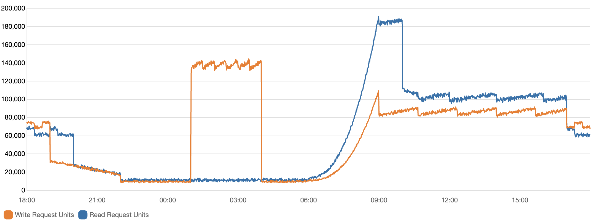
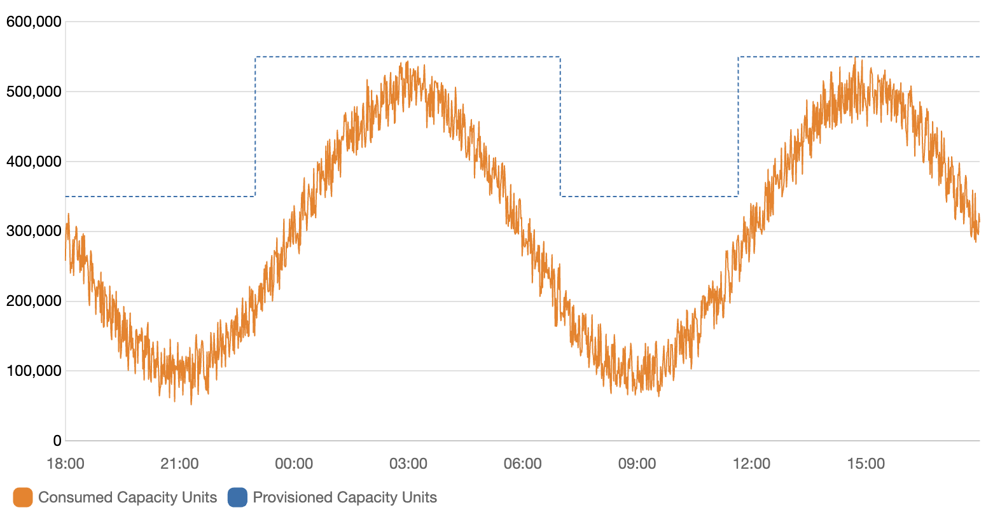
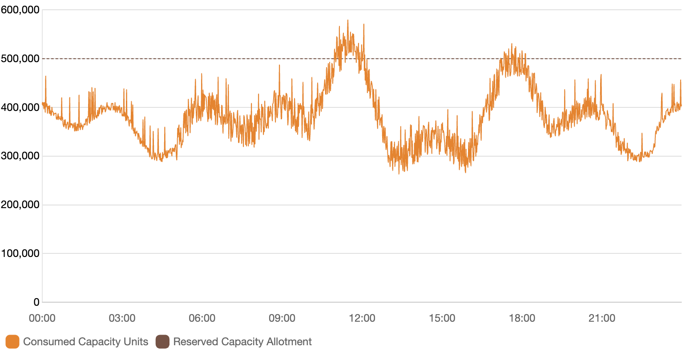

Real World Scenarios
--------------------

These scenarios help demonstrate the real costs of using DynamoDB. Each scenario is designed to describe a real-world use case based on ScyllaDB customers, and provides a detailed breakdown of the associated costs when running the same workload on DynamoDB.

On Demand Scenario
==================

When optimizing for cost, AWS advises [#r1]_ that the On Demand mode is ideal for workloads with the following characteristics:

* Traffic volumes that shift significantly throughout the day or week.
* Large swings in request load, such as those triggered by batch jobs or user behavior.
* Irregular or bursty access patterns that make it hard to predict usage.
* Periods of extremely low usage, often dipping below 30% of the daily peak.

The example graph below illustrates this type of workload.

This graph shows the total number of read request units (in blue) and write request units (in orange) over a 24 hour period. To convert this to ops/sec, we know that 1 read request unit = 1 read per second for an item up to 4 KB in size. So assuming this is making strongly consistent reads and the reads are ≤ 4 KB:

* At the peak, we can observe ~1,000,000 reads/sec.
* During the daytime period, we can observe ~600,000 reads/sec.
* In quieter periods, it drops to ~50,000 reads/sec.

For the writes, we know that 1 write request unit = 1 write per second for an item up to 1 KB in size. So assuming the writes are ≤ 1 KB:

* At the peak, we can observe ~840,000 writes/sec. This is a sustained peak and appears to be an overnight batch job.
* During the daytime period, we can observe ~500,000 writes/sec.
* In quieter periods, it drops to ~50,000 writes/sec.

But what's the cost of this workload in On Demand mode?
.......................................................

The problem with estimating workloads is the lack of real usage data. If you are already using DynamoDB, then you can use the `AWS Cost Explorer <https://docs.aws.amazon.com/amazondynamodb/latest/developerguide/CostOptimization_TableLevelCostAnalysis.html>`_ to accurately determine costs. If you are not yet using DynamoDB, then you would use the official `AWS calculator <https://calculator.aws/#/>`_, which only lets you input the average number of reads and writes per second, not the actual usage patterns. This means that if your workload has a lot of spikes or fluctuations, you may end up underestimating your costs.

Our `DynamoDB Cost Calculator <https://calculator.scylladb.com>`_ allows you to input a baseline plus a peak usage pattern for increased accuracy.

Using raw chart data, we can determine the following:

* Baseline of 410,000 reads/sec average for the 24 hour period, plus a peak of 1,000,000 reads/sec for 1 hour.
* Baseline of 380,000 writes/sec average for the 24 hour period, plus a peak of 800,000 writes/sec for 3 hours.

The `estimate for this On Demand workload on DynamoDB <https://calculator.scylladb.com/?pricing=demand&storageGB=512&itemSizeB=1024&tableClass=standard&baselineReads=410000&baselineWrites=380000&peakReads=1000000&peakWrites=800000&peakDurationReads=1&peakDurationWrites=3&reserved=0&readConst=100>`_ is around **$851,978/month** in On Demand mode.

A ScyllaDB `cluster configuration with 3 nodes of i4i.8xlarge <https://www.scylladb.com/product/scylla-cloud/get-pricing/?reads=400000&writes=400000&itemSize=1&storage=1&cloudProvider=AWS>`_, would cost around **$19,422/month**. This cluster could sustain up 936,000 ops/sec with peaks up to 1,440,000 ops/sec with a significant cost reduction.

.. raw:: html

    

      Estimating costs is hard. The flexibility of On Demand mode is great, but you pay a premium for this. This is because On Demand mode charges per request... and if you're not careful, you will pay excessive costs for your workload.

Provisioned Scenario
====================

When optimizing for cost, AWS advises [#r2]_ that the Provisioned mode is ideal for workloads with the following characteristics:

* Steady, predictable, and cyclical traffic for a given hour or day.
* Limited short-term bursts of traffic.

The following graph illustrates this type of workload.

Because traffic patterns are typically more predictable within an hour or day, you can provision table capacity closer to actual usage. Cost optimization in provisioned capacity mode is about minimizing the gap between provisioned capacity (blue line) and consumed capacity (orange line) without increasing ThrottledRequests. The difference between the two represents both wasted resources and a buffer to prevent throttling. If your application’s throughput is predictable and you value cost control, provisioned tables remain a viable option.

In this provisioned scenario, you might provision 350,000 ops/sec for the baseline, plus 550,000 ops/sec for the peaks lasting at least 12 hours combined.

Assuming a 50:50 read:write ratio, the `estimate for this Provisioned workload on DynamoDB <https://calculator.scylladb.com/?pricing=provisioned&storageGB=512&itemSizeB=1024&tableClass=standard&baselineReads=175000&baselineWrites=175000&peakReads=275000&peakWrites=275000&peakDurationReads=12&peakDurationWrites=12&reserved=0&readConst=100>`_ is around **$127,853/month** in Provisioned mode.

A ScyllaDB `cluster configuration with 3 nodes of i4i.4xlarge <https://www.scylladb.com/product/scylla-cloud/get-pricing/?reads=175000&writes=175000&itemSize=1&storage=1&cloudProvider=AWS>`_ would cost around **$9,711/month**. This cluster could sustain up to 468,000 ops/sec with peaks up to 720,000 ops/sec. That's more than enough to cover the workload at a fraction of the monthly cost.

.. raw:: html

    
DynamoDB still charges per request - provisioned capacity just gives you a volume discount. You’re still renting throughput. ScyllaDB charges per core, not per operation. You get predictable performance, linear scale-out, and full control over cost as your workload grows.

Reserved Capacity Scenario
==========================

Provisioned with reserved capacity is a good option for workloads that are steady and predictable. It allows you to reserve capacity for a specific period of time, which can help reduce costs by paying an upfront fee. However, it requires careful planning and forecasting to ensure that you reserve the right amount of capacity.

This graph shows the difference between reserved capacity (dotted line) and consumed capacity (orange line). The difference between the two represents both wasted resources and a buffer to prevent throttling. If your application’s throughput is predictable and you value cost control, reserved capacity remains a viable option. However, this leads to over-provisioning, which can be costly. You are still paying for the reserved capacity even if you are not using it.

Assuming a baseline of 300,000 writes/sec and a peak of 450,000 writes/sec for 3 hours a day, the `estimate for this workload on DynamoDB <https://calculator.scylladb.com/?pricing=provisioned&storageGB=512&itemSizeB=1024&tableClass=standard&ratio=50&baselineReads=0&baselineWrites=300000&peakReads=0&peakWrites=450000&peakDurationReads=0&peakDurationWrites=3&reserved=100&readConst=100>`_ is around **$450,000 upfront plus $36,935/month** in Provisioned + Reserved capacity mode.

.. raw:: html

    

      This underscores just how expensive DynamoDB can be, especially for write-heavy workloads, even with reserved capacity. The upfront cost is significant, and the monthly cost is still high. This is a common scenario for many DynamoDB users, and it’s important to carefully consider your options before committing to a specific capacity mode.

    

A Note on Auto Scaling
......................

DynamoDB’s auto scaling for provisioned tables adjusts capacity automatically based on usage patterns and configured parameters. It allows you to scale capacity throughout the day without manual intervention. This can be seen in the graph above, where the blue line represents the provisioned capacity and the orange line represents the consumed capacity. The difference between the two represents both wasted resources and a buffer to prevent throttling.

Even with auto scaling, some level of over-provisioning is inevitable. Tuning the balance between extra capacity and acceptable throttling takes effort and experimentation. While you can technically autoscale around smooth traffic patterns, it’s not a plug-and-play solution—you’ll need to test and adjust over time.

DynamoDB’s pricing models are intricate and require deliberate planning. Without careful sizing, you risk either paying for idle capacity or facing throttling that degrades performance. Use our `DynamoDB Cost Calculator <https://calculator.scylladb.com>`_ to simulate your workloads and avoid surprises.

ScyllaDB follows a fundamentally different pricing model. Instead of charging per request or provisioned capacity, you pay for the infrastructure - specifically, the number and size of nodes in your cluster. While this is technically a form of over-provisioning, it's far more predictable and manageable. You can start with a small cluster and scale out as your workload grows, without worrying about request-level provisioning limits or unexpected costs.

.. raw:: html

    
This is why ScyllaDB is a strong alternative to DynamoDB - we offer a 50% cost guarantee against your existing workload.

Global Tables Scenario
======================

One of the cost amplifiers of DynamoDB is Global Tables [#r3]_. This feature allows you to replicate your data across multiple AWS regions, which can be useful for high availability and low latency access. However, it also comes with significant cost.

These costs can be broken down into two main components:

* Replication costs
    Each write to a Global Table incurs a replicated Write Capacity Unit (rWCU) charge in each region where the table is replicated. This means that if you have a write-heavy workload, you could end up paying for multiple writes for each item you write.
* Network costs
    Data transfer between regions incurs additional costs. This can add up quickly, especially if you have a lot of data being replicated.

For more understanding of when to choose (and when to avoid) Global Tables, please refer to our :doc:`Global Tables <global-tables>` guide and the Global Tables FAQ [#r4]_.

To understand the cost of Global Tables, we will use one of our customers as an example. They had a workload with the following characteristics, backing a recommendation engine for a large streaming platform.

Their average item size was 8 KB, which (as we described in our :doc:`Units <units>` section)  means that each read and write operation would consume 1 RCUs (for eventually consistent reads) and 8 WCUs respectively. They had a total of 224 TB of replicated data in their table, which was replicated across 5 regions. The table was using eventual consistency for reads.

The workload had the following characteristics:

* Reads: 45,000 reads/sec
* Writes: 12,000 writes/sec
* Peak: 631,000 writes/sec with a duration of 8 hours
* Replication: 5 regions

Writes were mainly to a single availability zone in us-east-1. Other data centers (DCs) were very rarely written to, so the majority of writes were simply replicated to the other regions.

TTL in DynamoDB still counts as a write operation, so it can add up quickly if you have a lot of data being deleted. In this case, the customer was using TTL to delete data that was no longer needed, but it was not actually used in practice. The data was usually overwritten within a few hours, so the TTL was not actually used.

The customer was comfortable with eventually consistent reads, especially in remote DCs. If they returned today’s or yesterday’s recommendations, it was still fine.

We were able to `simulate this workload <https://calculator.scylladb.com/?pricing=provisioned&storageGB=229376&itemSizeB=8192&tableClass=standard&ratio=50&baseline=45000&peak=631000&peakWidth=0&reserved=100&readConst=0&baselineReads=45000&baselineWrites=12000&peakReads=45000&peakWrites=631000&peakDurationReads=0&peakDurationWrites=8>`_ and for a single DC, (i.e. with no Global Tables), the provisioned + reserved capacity cost alone was **$157,500 upfront with ongoing $839,647/month**.

This was a huge cost for a single DC, but with Global Tables `the cost amplified to <https://calculator.scylladb.com/?pricing=provisioned&storageGB=229376&itemSizeB=8192&tableClass=standard&ratio=50&baseline=45000&peak=631000&peakWidth=0&reserved=100&readConst=0&baselineReads=45000&baselineWrites=12000&peakReads=45000&peakWrites=631000&peakDurationReads=0&peakDurationWrites=8&regions=5>`_ **157,500 upfront with ongoing $4,111,903/month**. This is a staggering increase in cost for the sake of regional high availability and lower latency.

.. raw:: html

    
Global Tables are a great feature, but they come with a cost. If you’re using Global Tables, be sure to factor in these costs when estimating your overall DynamoDB costs. You can simulate these costs using our <a href="https://calculator.scylladb.com">DynamoDB Cost Calculator</a>.

DAX Scenario
============

Another cost amplifier of DynamoDB is DAX (Amazon DynamoDB Accelerator). This is a caching layer that sits in front of your DynamoDB tables and can help reduce the number of read requests to DynamoDB. However, it also comes with its own costs.

DAX costs scale with the number of provisioned nodes and cached data volume. To illustrate this, we will use a customer example. They had a workload with the following characteristics:

* Reads: 4,000 reads/sec
* Peak: 105,000 reads/sec with a duration of 4 hours
* Writes: 6,000 writes/sec
* Writes: 30,000 writes/sec
* Item size: 246B
* Storage: 1.1 TB
* Replication: 4 regions

At first glance, this workload would seem to be cost efficient. The `cost using provisioned + reserved capacity <https://calculator.scylladb.com/?pricing=provisioned&storageGB=1152&itemSizeB=1024&tableClass=standard&ratio=50&baseline=45000&peak=631000&peakWidth=0&reserved=100&readConst=100&baselineReads=4000&baselineWrites=6000&peakReads=105000&peakWrites=30000&peakDurationReads=4&peakDurationWrites=4&regions=4>`_ would be around **$10,200 upfront with ongoing $9,686/month**, or around 126k per year.

However, this customer was reporting much higher costs with DynamoDB, and they were servicing around 20B daily requests. In this case, the cost amplification was due to the fact that they were using DAX to cache their reads. The cost of DAX can add up quickly, especially if you have a lot of data being cached.

Their use of DAX can be characterized as follows:

* User ID caching:
    * 6 nodes of dax.r4.4xlarge in eu-west-1
    * 6 nodes of dax.r4.2xlarge in us-east-1
    * 6 nodes of dax.r4.2xlarge in us-west-1
    * 6 nodes of dax.r4.4xlarge in ap-northeast-1
* Entities caching:
    * 6 nodes of dax.r4.xlarge in eu-west-1
    * 6 nodes of dax.r4.2xlarge in us-east-1
    * 6 nodes of dax.r4.xlarge in us-west-1
    * 6 nodes of dax.r4.xlarge in ap-northeast-1

So in total, the customer was running 48 DAX nodes of varying size across 4 regions.

The cost of DAX is based on the number of nodes you provision; however, this cost cannot be reserved in a similar way to EC2. The cost of DAX works out to be the node's hourly rate multiplied by the number of hours in a month (730).

For this use case, the cost was approximately:

* 12 x 2.148 x 730 = $18,816/month for the r4.4xlarge
* 18 x 1.074 x 730 = $14,112/month for the r4.2xlarge
* 18 x 0.537 x 730 = $7,056/month for the r4.xlarge

The total cost of DAX was **$39,984/month or $480,000/year**. This is a staggering cost for a caching layer, especially when you consider that the customer was already paying for the provisioned + reserved capacity of **$126,000/year**.

Estimating the cost of DAX upfront is difficult, as it depends on the number of nodes you provision and the amount of data stored in the cache. You also need to know your target utilization and hit/miss rate of your caching layer to get closer to a real estimate. In many cases (such as this real world scenario), you will need to overprovision your DAX nodes to ensure that you have enough regional capacity to handle your workload and meet your latency requirements.

You can use our `DynamoDB Cost Calculator <https://calculator.scylladb.com>`_ to simulate your workloads and get a better understanding of your costs, including DAX. Our calculator uses DAX cluster sizing to approximate the cost of DAX based on the number of nodes you provision and the amount of data stored in the cache [#r5]_. 

By using ScyllaDB, you can avoid the costs associated with DAX and still get the cache performance you need. ScyllaDB has a built-in caching layer that is automatically managed and does not require any additional provisioning or configuration. This reduces both operational complexity and cost. Read our :doc:`DAX Caching <dax>` guide to see how DAX compares to ScyllaDB.

.. rubric:: **References**

.. [#r1] `On Demand Cost Optimization <https://docs.aws.amazon.com/amazondynamodb/latest/developerguide/CostOptimization_TableCapacityMode.html#CostOptimization_TableCapacityMode_OnDemand>`_: Cost Optimization with On-Demand Mode
.. [#r2] `Provisioned Cost Optimization <https://docs.aws.amazon.com/amazondynamodb/latest/developerguide/CostOptimization_TableCapacityMode.html#CostOptimization_TableCapacityMode_Provisioned>`_: Cost Optimization with Provisioned Mode
.. [#r3] `Amazon DynamoDB Global Tables <https://aws.amazon.com/dynamodb/global-tables/>`_: Understanding Global Tables
.. [#r4] `Global Tables FAQ <https://docs.aws.amazon.com/prescriptive-guidance/latest/dynamodb-global-tables/faq.html>`_: Prescriptive Guidance for Global Tables
.. [#r5] `DAX Cluster Sizing <https://docs.aws.amazon.com/amazondynamodb/latest/developerguide/dax-cluster-sizing.html#dax-sizing-dataset-size>`_: Calculating approximate cluster capacity requirements
